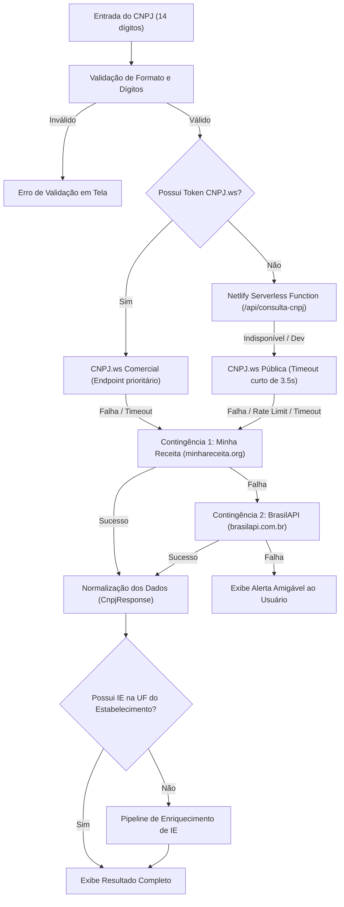

# 🚀 ATOPY — Consulta CNPJ

Aplicação web moderna, resiliente e segura para **consulta cadastral de empresas brasileiras** via CNPJ. O sistema extrai e unifica dados oficiais da **Receita Federal do Brasil (RFB)** e das **Secretarias de Fazenda Estaduais (SEFAZ / Sintegra / CCC)**, oferecendo geração de comprovantes em PDF, redundância contra quedas de serviços e gerenciamento de Inscrição Estadual (IE).

---

## 📋 Sumário

- [Visão Geral](#-visão-geral)
- [Como Funciona a Consulta (Fluxo e Arquitetura)](#-como-funciona-a-consulta-fluxo-e-arquitetura)
- [De Onde Vêm os Dados?](#-de-onde-vêm-os-dados)
- [Por Que é Altamente Confiável?](#-por-que-é-altamente-confiável)
- [Enriquecimento e Gestão de Inscrição Estadual (IE)](#-enriquecimento-e-gestão-de-inscrição-estadual-ie)
- [Recursos e Funcionalidades](#-recursos-e-funcionalidades)
- [Stack Tecnológica](#-stack-tecnológica)
- [Como Executar o Projeto](#-como-executar-o-projeto)
- [Configuração de Provedores Opcionais](#-configuração-de-provedores-opcionais)
- [Deploy no Netlify](#-deploy-no-netlify)

---

## 🔍 Visão Geral

O **Consulta CNPJ** foi desenvolvido para resolver problemas clássicos em rotinas fiscais, comerciais e cadastrais:
1. **Lentidão ou indisponibilidade** em consultas públicas convencionais da Receita Federal.
2. **Dificuldade na localização da Inscrição Estadual (IE)** ativa, especialmente em estados com regras específicas ou sem integração aberta no CNPJ da Receita.
3. **Necessidade de gerar comprovantes limpos e padronizados em PDF** para anexar a cadastros de clientes ou fornecedores.
4. **Manutenção do histórico e correção manual colaborativa** de dados quando necessário.

---

## ⚙️ Como Funciona a Consulta (Fluxo e Arquitetura)

O sistema foi desenhado sob o princípio de **alta disponibilidade com contingência automática (failover em cascata)**. Quando um CNPJ de 14 dígitos é informado, o fluxo de consulta executa os seguintes passos:



### Passo a passo da busca:
1. **Sanitização e Validação**: O CNPJ é limpo de pontuações e validado localmente.
2. **Tentativa Principal**:
   - Caso um token comercial esteja cadastrado, a chamada é direcionada prioritariamente para o endpoint da `CNPJ.ws Comercial`.
   - Em produção no Netlify, a requisição passa pela Serverless Function [`/api/consulta-cnpj`](netlify/functions/consulta-cnpj.ts), protegendo os cabeçalhos e otimizando a resposta.
   - Em chamadas públicas diretas, é acionada a API aberta da `CNPJ.ws` com timeout preventivo de 3,5 segundos para evitar travamentos de tela.
3. **Contingência Automática 1 (Minha Receita)**: Se o provedor primário estiver fora do ar, lento ou atingir limites de taxa, o sistema redireciona a chamada para a API aberta da **Minha Receita**.
4. **Contingência Automática 2 (BrasilAPI)**: Se o primeiro fallback também não responder, uma segunda contingência é acionada com a **BrasilAPI**.
5. **Mapeamento Normalizado**: Independentemente do provedor que respondeu, os dados são padronizados para o mesmo formato (`CnpjResponse`), garantindo que o restante da interface e o PDF funcionem de forma idêntica.

---

## 🌐 De Onde Vêm os Dados?

Todos os dados exibidos têm como **fonte primária e originária a base oficial de Dados Públicos do CNPJ da Secretaria Especial da Receita Federal do Brasil (Ministério da Fazenda)**.

| Provedor / Camada | Tipo | Dados Fornecidos | Atualização |
| :--- | :--- | :--- | :--- |
| **Receita Federal do Brasil (RFB)** | Fonte Primária | Base de dados abertos nacional do CNPJ | Mensal / Periódica oficial |
| **CNPJ.ws** | Gateway / API | Dados da RFB espelhados com alta velocidade e IEs de alguns estados | Em tempo real via CDN |
| **Minha Receita** | Gateway Open Source | Espelho dos dados abertos oficiais da RFB com API pública de alta resiliência | Atualizações públicas periódicas |
| **BrasilAPI** | Gateway Aberto Comunitário | Dados da RFB, CEP, IBGE e geolocalização | Contínua |
| **SEFAZ / Sintegra / CCC** | Órgãos Fazendários Estaduais | Situação de Inscrição Estadual, regime de tributação e IEs ativas | Consultas em tempo real via webservices |

---

## 🛡️ Por Que é Altamente Confiável?

1. **Fontes Governamentais Oficiais**:
   - A ferramenta **não inventa nem infere dados cadastrais**. Razão social, sócios, endereço, CNAEs e situação cadastral refletem exatamente o cadastro da empresa na Receita Federal.
2. **Resiliência contra Quedas (Zero Downtime)**:
   - Serviços governamentais diretos sofrem com frequência de instabilidade, manutenções ou CAPTCHAs. O modelo em três camadas (`CNPJ.ws` ➔ `Minha Receita` ➔ `BrasilAPI`) garante que, mesmo que um ou dois servidores estejam instáveis, o usuário final continue consultando sem interrupções.
3. **Transparência da Origem da Informação**:
   - A interface identifica de onde vieram os dados e qual provedor atendeu a requisição, além de indicar claramente a origem da Inscrição Estadual (Base Pública, Sintegra, SEFAZ, Nuvem Fiscal ou Ajuste Manual).
4. **Diferenciação Visual de Status Cadastral**:
   - Empresas com status **ATIVA** recebem destaque em verde; situações como **BAIXADA**, **SUSPENSA**, **INAPTA** ou **NULA** são imediatamente alertadas com tags de perigo, evitando emissões ou transações com cadastros irregulares.
5. **Garantia de Segurança e Privacidade**:
   - Não há gravação de senhas, certificados confidenciais ou dados sigilosos no repositório. O `.gitignore` é configurado para reter arquivos locais `.env` e certificados `.pfx/.p12`.

---

## 🏛️ Enriquecimento e Gestão de Inscrição Estadual (IE)

As bases gerais da Receita Federal são federais e, por isso, frequentemente **não possuem o cadastro detalhado da Inscrição Estadual** ou possuem registros defasados em relação às Secretarias de Fazenda de cada estado (por exemplo, no Paraná - PR).

Para resolver essa limitação, o sistema implementa um **funil de enriquecimento de IE**:

1. **Base Customizada Interna (Local / Netlify Blobs)**: Se alguém da equipe já pesquisou e salvou a IE correta para aquele CNPJ, o dado é resgatado instantaneamente.
2. **SEFAZ A1 (Webservice Estadual `CadConsultaCadastro4`)**: Em ambiente que utilize certificado digital A1, o sistema é capaz de consultar o webservice oficial da SEFAZ do estado correspondente.
3. **SintegraWS (Opcional)**: Integração com o provedor especializado SintegraWS para resgatar a IE ativa do estado.
4. **Nuvem Fiscal (Opcional)**: Integração OAuth 2.0 para consulta ao Cadastro Centralizado de Contribuintes (CCC).
5. **Facilitador de Consulta Externa (Sintegra Oficial)**:
   - Se nenhuma API contiver a IE (ou para CNPJ do Paraná com regras específicas de acesso), o sistema copia o CNPJ para a área de transferência e disponibiliza um link direto para o portal do Sintegra estadual com instruções claras.
6. **Edição Manual e Persistência**:
   - O usuário pode clicar no botão de lápis, digitar a IE oficial localizada no Sintegra e salvá-la. A IE fica salva e sincronizada para as próximas consultas e é incorporada ao comprovante em PDF.

---

## ✨ Recursos e Funcionalidades

- **Consulta Instantânea**: Digitação rápida com formatação automática de máscara de CNPJ (`00.000.000/0000-00`).
- **Resumo Executivo Cadastral**:
  - Razão Social, Nome Fantasia, CNPJ e Tipo (Matriz ou Filial).
  - Situação Cadastral com data do status e motivo (se aplicável).
  - Inscrição Estadual com selo de identificação da origem.
  - Endereço completo formatado com botão para copiar em um clique.
  - Atividade Econômica Principal e Secundárias com código CNAE oficial.
  - Contatos (Telefones e E-mail), Capital Social e Quadro Societário (QSA).
- **Geração de Comprovante em PDF**:
  - Layout formal A4 gerado diretamente no navegador via `jsPDF`.
  - Contém cabeçalho com identidade visual, dados cadastrais completos, endereço, CNAEs e Inscrição Estadual informada/enriquecida.
- **Histórico de Buscas Recentes**:
  - Armazenado localmente no navegador (`localStorage`) para reaproveitamento rápido.
- **Painel de Configuração de Provedores**:
  - Drawer amigável para inserir tokens de API adicionais (CNPJ.ws, SintegraWS, Nuvem Fiscal) sem necessidade de mexer em código.

---

## 🛠️ Stack Tecnológica

- **Frontend**: [React 18](https://react.dev/) + [TypeScript](https://www.typescriptlang.org/)
- **Build & Dev**: [Vite](https://vitejs.dev/)
- **Estilização**: [Tailwind CSS v4](https://tailwindcss.com/) com paleta personalizada da marca **ATOPY**
- **Geração de PDF**: [jsPDF](https://github.com/parallax/jsPDF)
- **Serverless & Nuvem**: [Netlify Functions](https://docs.netlify.com/functions/overview/) + [Netlify Blobs](https://docs.netlify.com/blobs/overview/)
- **Fontes**: Poppins (títulos/destaque) e Inter (corpo)

---

## 🚀 Como Executar o Projeto

### Pré-requisitos
- [Node.js](https://nodejs.org/) versão 18 ou superior
- [npm](https://www.npmjs.com/)

### Instalação

1. Clone o repositório:
```bash
git clone https://github.com/joaovictor0902/cnpj-consulta.git
cd cnpj-consulta
```

2. Instale as dependências:
```bash
npm install
```

3. (Opcional) Crie o arquivo de variáveis de ambiente com base no exemplo:
```bash
cp .env.example .env
```

4. Inicie o servidor de desenvolvimento:
```bash
npm run dev
```

Acesse o endereço exibido no terminal (geralmente `http://localhost:5173`).

### Scripts Disponíveis

- `npm run dev`: Executa o servidor de desenvolvimento Vite.
- `npm run build`: Valida tipagens com TypeScript (`tsc --noEmit`) e gera a build de produção otimizada em `dist/`.
- `npm run preview`: Executa um servidor local servindo a pasta `dist/` gerada.

---

## 🔑 Configuração de Provedores Opcionais

O projeto funciona **100% gratuitamente** utilizando as fontes públicas sem necessidade de cadastrar nenhum token. No entanto, se sua operação necessitar de consultas comerciais em larga escala ou integração direta de IE, você pode configurar provedores através de:

1. **Variáveis de Ambiente** (`.env`):
   ```env
   # CNPJ.ws comercial (IE automática)
   VITE_CNPJ_WS_TOKEN=seu_token_aqui

   # SintegraWS (Consultas de IE no Sintegra)
   VITE_SINTEGRA_WS_TOKEN=seu_token_aqui

   # Nuvem Fiscal (OAuth 2.0 / Cadastro de Contribuintes)
   VITE_NUVEM_FISCAL_CLIENT_ID=seu_client_id
   VITE_NUVEM_FISCAL_CLIENT_SECRET=seu_client_secret
   VITE_NUVEM_FISCAL_USE_SANDBOX=false
   ```
2. **Interface Visual (Drawer de Configurações)**:
   - Clique no ícone de chave no canto superior da aplicação para preencher os tokens diretamente no navegador e testar a conexão em tempo real.

---

## ☁️ Deploy no Netlify

O projeto já possui configuração pronta para o Netlify através do arquivo [`netlify.toml`](netlify.toml):

- **Build Command**: `npm run build`
- **Publish Directory**: `dist`
- **Functions Directory**: `netlify/functions`
- **Persistência de IEs**: Utiliza o `@netlify/blobs` para armazenar as IEs salvas pela equipe sem necessidade de configurar um banco SQL externo.

Para realizar o deploy:
1. Conecte o repositório no Netlify.
2. Defina os plugins e variáveis de ambiente (se desejar).
3. O deploy do frontend e das serverless functions será realizado automaticamente.

---

## 📄 Licença

Este projeto é de uso interno e proprietário. Consulte os mantenedores do projeto para permissões de uso e distribuição.
